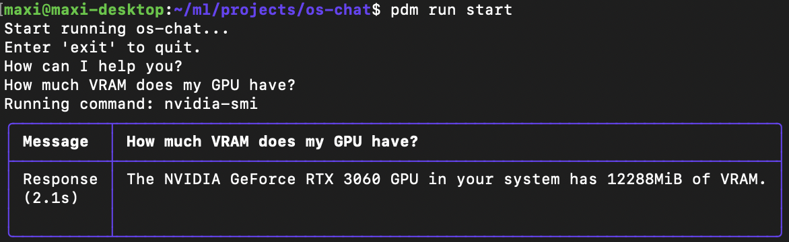
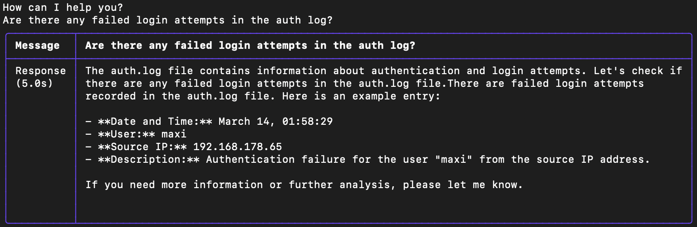
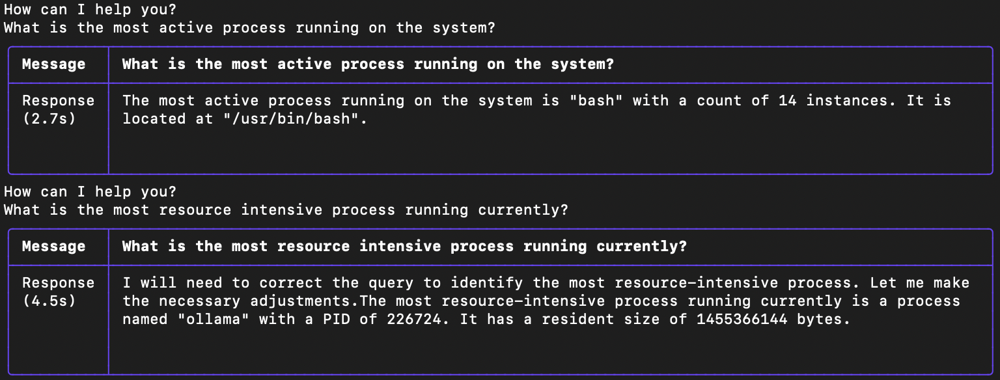

# os-chat: Chat with your Computer

**os-chat** allows you to chat with your computer, retrieving all kind of information from log files, CLI commands and an osquery interface.



## ✨ Getting Started

### ☑️ Step 1: Prerequisites

1. Install [osquery](https://osquery.io/downloads/official/)
2. Install [PDM](https://pdm-project.org/latest/)

### 🛠️ Step 2: Installation

Setup the project with

```bash
pdm install
```

### ⚙️ Step 3: Configure API Key

Setup OpenAI API key:

```bash
export OPENAI_API_KEY=sk-***
```

### 🎉 Step 4: Start os-chat

```bash
pdm run start
```

## 📊 Benchmark

The goal of the benchmark is to measure the ability of different LLMs to retriev the relevant information from the available interfaces.

| Model Name | Model Type | Retrieval Accuracy
| -------- | -------- | -------- |
| gpt-3.5-turbo  | API   | 1.0 |
| llama2 7b      | local | 0.0 |
| llama2 7b-chat | local | 0.0 |
| openhermes     | local | 0.0 |

Currently local LLMs are not able to use the interface correctly and therefore retriev no information.

To run the benchmark use the following pdm script:

```bash
pdm run benchmark
```

**Note:** Currently the benchmark targets are hardcoded for one specific test system and need to be adapted to run on any other system.

## More Examples




